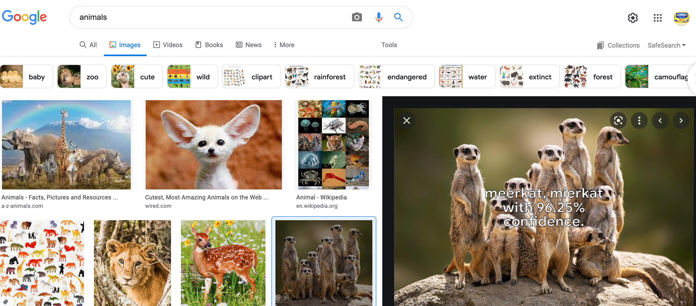

# Chrome Extension Multiclass CNN Demo
## NOTE: This extension will NOT work on chromebooks
----

Method 1 (Easy):
----
1. Click the green `Code` button and `Download ZIP`. 
2. Unzip the file and make note of where you downloaded it and the name of the downloaded folder. Most likely it will be in your `Downloads` folder and will be called `chrome-image-classifier-main`. 
3. Now navigate to `chrome://extensions`, make sure that the `Developer mode` switch is turned on in the upper right, and click `Load Unpacked`.  Then enter the `chrome-image-classifier-main` folder and select the `dist` directory.

4. The extension should now be enabled and can be tried out by going to a site with images (preferably the google images page), then right click an image and select the menu option `Classify image with Tensorflow.js`.


Method 2 (Hard):
----

Only use if method 1 fails. First make sure you have `node` installed. If not [install it here](https://nodejs.org/en/). Clone this repo and from the project directory run the following commands in the terminal.

```sh
sudo npm install -g yarn
yarn
yarn build
```
Now you can proceed with steps 3 and 4 as outlined in Method 1.
